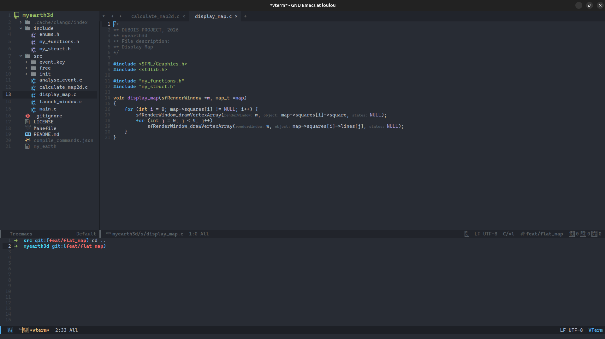

# MYEmacs

This is a custom Emacs configuration for Linux, designed for general-purpose development.

## Overview

Here is a preview of the project:



---

## 🛠️ Install the Project

### Clone the Repository

#### With HTTPS (URL)

```bash
git clone https://github.com/Louis-dub/MYEmacs.git
```

#### With SSH

```bash
git clone git@github.com:Louis-dub/MYEmacs.git
```

---

### Install Configuration

#### 1. Navigate to the repository

```bash
cd MYEmacs
```

#### 2. Make the installation script executable

```bash
chmod 755 install.sh
```

#### 3. Launch the installation

```bash
./install.sh
```

---

### Post-Installation Steps

1. **Restart Emacs** to apply the configuration:
  ```bash
   emacs
  ```
2. **Install the Tree-sitter grammars**:
   Type M-: and enter this command:
   ```elisp
   (mapc #'treesit-install-language-grammar (mapcar #'car treesit-language-source-alist))
   ```

---

### Troubleshooting

#### Emacs GUI does not launch

- Ensure you installed `emacs-gtk` or `emacs` with GUI support.
- Run Emacs with:
  ```bash
  emacs &
  ```

#### LSP servers are not working

- Verify that `tsserver` and `vscode-html-language-server` are installed:
  ```bash
  npm install -g typescript @vscode/html-language-server
  ```

#### Missing packages in Emacs

- Manually refresh and install packages:
  ```bash
  emacs --batch --eval "(package-refresh-contents)" --eval "(package-install 'use-package)"
  ```

---

### Supported

#### Languages
- C / C++
- Python
- HTML / CSS
- JavaScript
- TypeScript

#### FrameWorks
- React (JSX/TSX)

#### Configuration formats
- JSON
- YAML

#### Containerisation
- Docker

---

### Customization

- **Change the theme**: Edit `init.el` and modify the `(load-theme 'doom-one t)` line.
- **Add new packages**: Use `use-package` in `init.el` and run `M-x package-install <package-name>`.

---

### License

MIT
